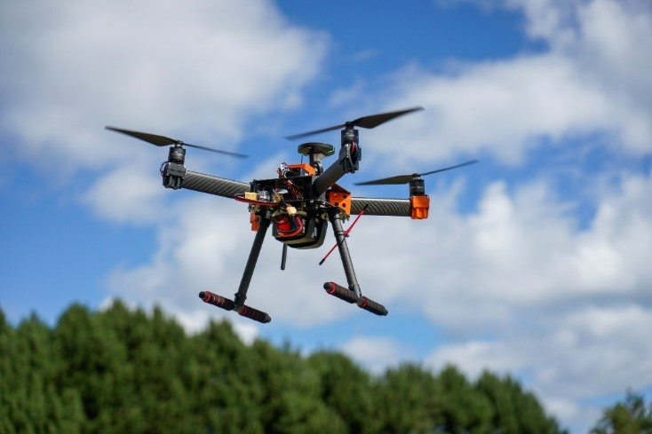

# Drone Engineering Ecosystem   
## 1. General description

The Drone Engineering Ecosystem is an environment developed by degree and master students that allows for the planning, execution & monitoring of drone operations.
The system can be used to perform a wide variety of operations, ranging from manual drone operation to automatic flights, and has support in Windows, Android and as a web app through the use of various applications.

## 2. Environment structure


The system is organized in 3 levels:


* **A. On-board services:** These modules control the different devices of the drone platform (the autopilot, camera, LEDs, servo, etc.).

* **B. Back-end services:** for data storage and recovery. 

* **C. Front-end services:** allow the user to control the drone (specifying flight plans, showing the images send by the drone, etc.).

These modules communicate through MQTT, a lightweight communication protocol (more on that later). This communication is carried out by *brokers* (one internal running on board, and one external running in internet).

The modules of the ecosystem are in development. Each of them has a repo in GitHub with the code and detailed information. This is a brief description of each module:
 
 ### On-board
 
* *Autopilot service*:
[](https://github.com/dronsEETAC/DroneAutopilotDEE) controls the autopilot to execute the commands coming from other modules (arm, takeoff, go to position, etc.).    

* *Camera service*:
[](https://github.com/dronsEETAC/CameraControllerDEE) controls the on-board camera to execute the commands coming from other modules (take a picture, get the video stream, etc.)       
   
* *LEDs service*:
[](https://github.com/dronsEETAC/LEDsControllerDEE) controls the LEDs of the drone platform to inform of the status of the drone platform, or a servo installed in the platform, as required by other modules.

### Back-end modules

* *Monitor*:
[](https://github.com/dronsEETAC/MonitorDEE) records on board data for future analysis (for instance, all the messages send through the brokers.    

* *API REST*:
[](https://github.com/dronsEETAC/RESTAPIDEE) a server that provides data storage and retrieval through HTTP basic operations (GET, POST, PUT, DELETE).      

* *Data service*:
[](https://github.com/dronsEETAC/DataServiceDEE) controls the data storage and retrieval in the API REST, as required by the rest of modules.

### Front-end modules

* *Dashboard*:
[](https://github.com/dronsEETAC/DashboardDEE) a desktop application (Python + tkinter) that allows the global control of the system (define flight plans, process data coming from the drone, arm, take-off, etc.).

* *DashApp*:
[](https://github.com/dronsEETAC/DashboardVueDEE) a web app (Vue) with similar functionalities to Dashboard, but that can be operated from a laptop connected to internet.

* *Drone Circus*:
[](https://github.com/dronsEETAC/DroneCircusDEE) a desktop application (Python + tkinter) that allows the user to interact with the drone platform in a fun way (for instance, guide the drone with body poses or with the voice).
   
* *Mobile app*:
[](https://github.com/dronsEETAC/IonicVueMobileAppDEE) a web app (Vue + Ionic) with a reduced set of functionalities that can be operated from a mobile phone or Tablet connected to internet.

**Demos of the different services can be found in their respective repos.**

In addition to these modules, the ecosystem uses:
1. An internal broker (Mosquitto) running on-board to facilitate the communication among on-board services.
2. An external broker (Mosquitto) running in internet to facilitate the communication between front-end and back-end modules and the drone platform.
3. The Mission Planner, that is used for development purposes, since it provides an autopilot simulator, so that the ecosystem can be developed and tested without requiring a real drone platform.

## 3. A case example

The best way to understand how the Drone Engineering Ecosystem works is through an example. Suppose a farmer with a very big wheat field. The farmer wants to know the health of their crops and will use [NDVI processing](https://www.usgs.gov/landsat-missions/landsat-normalized-difference-vegetation-index) to do so. For that end, he’ll need a drone with a multispectral camera with which he will photograph the entire surface of his field.

Using the Dashboard, the farmer can prepare the mission by indicating the waypoints to visit and the points where a photo should be taken. The Dashboard will send the flight plan to the Autopilot service and instructions to the Camera service on when to take the photos.

Then, already at the wheat field, the farmer can use the mobile application to give the order to start the flight plan. From this application the farmer can also make decisions in an emergency (stop, land, return home, etc.). In addition, on the mobile phone, the farmer can see the photos that the drone is taking. Those photos are also sent to the data service which stores them in the database for further analysis.

Now imagine that the farmer does not want to receive all the photos, but only those in which the average NDVI is less than 0,4. Also, the farmer wants the selected photos to be stored on-board and download and process them once the drone has landed. These additional functionalities may require the development of additional modules, such as an image processing service and a data storage and retrieval service, both on board.

## 4. The drone platform



The drone platform can be seen in the figure. It uses a HexSoon kit for the frame and motors, an Orange Cube Pixhawk as flight controller and a Raspberry Pi as on board computer (the red box). The platform includes also a camera, a servo, a button and a collection of LEDs.   

A detailed guide on how to assemble, configure and tune up the drone platform can be found here:
[Transversal Project Guide](/TransversalProjectGuide.pdf)

## 5. Communication modes & the MQTT protocol
In relation to communication system, the Drone Engineering Ecosystem can work in two modes, which are shown in the figure.    


### Global mode (ONLINE)

In global mode all 3 levels (on-board, front-end & back-end) are connected to the Internet via Wi-Fi and communicate through an external broker. Any public access broker can be used as an external broker, or the private broker that runs on a server at the Campus facilities (which requires access credentials).

### Local mode (OFFLINE)

Local mode should be use when there is no Wi-Fi coverage where the operation is taking place. In this situation the drone platform acts as a hotspot from which the front-end modules must connect.

The external broker is also executed on-board, and because of this the on-board modules must connect to this broker using the address *localhost:8000*, while the external modules must use the address *10.10.10.1:8000*. Naturally, in local mode it is not possible to use back-end services which need internet connection to operate.

### The MQTT protocol

The Drone Engineering Ecosystem uses Mosquitto brokers to facilitate the communication among the different modules. Mosquitto brokers implement the MQTT (Message Queuing Telemetry Transport) communication protocol. You can learn more about MQTT here: 
[MQTT protocol](http://www.steves-internet-guide.com/mqtt/)
 
MQTT is based on a simple publication/subscription mechanism. Let's see how this protocol is used in the Drone Engineering Ecosystem. Assume that all the modules are connected to a Mosquitto broker. The Autopilot Service may subscribe to the following topic:

```
dashboard/autopilotService/takeOff
```

If the Dashboard publishes a message in the broker with exactly this topic, the Autopilot Service will run a function where (presumably) it will send the command to the drone to take off. In some case, the published message will include additional information requited by the subscriber. For instance, the Autopilot Service may require a value indicating the altitude to be reached in the take-off operation. The additional information is included in the payload of the message

The Autopilot Service may want to inform the Dashboard that the drone has reached the required altitude. In this case, it will publish a message with the following topic:

```
autopilotService/dashboard/takenOff
```

Obviously, the Dashboard must have subscribed to this topic in order to receive the message.  

Note that our convention for the topic format is: 

```
name_of_the_origin_module/name_of_the_destination_module/command
```

We can imagine that the Autopilot Service must be ready to accept commands from any of the modules of the ecosystem (not only from the Dashboard) and not only the *takeOff* command. So, the Autopilot Service must subscribe to this topic:

```
+/autopilotService/+
```

This indicates that it can accept any command from any module. Obviously, the function that runs when a message is received must analyze the topic to identify the origin module and the command required (and possibly extract the payload it the message is coming with additional data).
  
More details on the brokers required to support the communication in the Drone Engineering Ecosystem can be found in section 7.

**In the repo of each of the service modules of the ecosystem you will find detailed information on the topic format for each of the services provided by the module.**

## 6. Operation modes

The system can be run in production mode and in simulation mode.

The **production mode** corresponds to the actual execution of the missions. Naturally, in that case the on-board services must be run on the on-board computer. Section 8 provides some important details on how to start the on-board services.

In **simulation mode** all modules (including brokers) run on the same computer (for example, a laptop). In this case, Mission Planner is needed, which incorporates a simulator that will be controlled by the Autopilot service exactly as it would be in production mode.

## 7. Tools required & support material

You will require require quite a few tools in order to contribute to the Drone Engineering Ecosystem.

### [Git](https://git-scm.com/) and [GitHub](https://github.com/)

We use Git and GitHub to have the software available to everybody in the cloud, to manage different versions of the software and to organize the integration of the contributions of different participants in the project. So, create your own account in GitHub and install Git in your computer.

### [Mosquitto](https://mosquitto.org/)

As seen in the figure of [section 5](#5-communication-modes--the-mqtt-protocol), two brokers are needed: the internal and the external broker.   

The internal broker will be always run in *localhome*, port 1884, in your laptop when working in simulation mode and in the on-board computer when working in production mode.

The external broker when working in global mode can be any public broker listening in port 8000 using [WebSocket protocol](https://www.geeksforgeeks.org/what-is-web-socket-and-how-it-is-different-from-the-http/). We use either *broker.hivemq.com* or *classpip.upc.edu*. This second option requires credentials (username and password) that will be provided by the academic responsibles of the project when required.

When working in global + simulation mode the external broker can also run in *localhome*, in port 8000 using WebSockets protocol.

When working in local mode the external broker must run in the on-board computer, also in port 8000 using WebSocket protocol.

There are many tutorials in internet (and down below) on how to install and configure Mosquitto in Ubuntu and in Windows. See below for tutorial materials on MQTT and Mosquitto.

Use this configuration file to start the internal broker:

```
listener 1884
allow_anonymous true
```

Use this configuration file to start the external broker in *localhome*:

```
listener 1883
allow_anonymous true
listener 8000
protocol websockets
allow_anonymous true
```

You can also use the broker running at classpip.upc.edu:8000 in a server in the Campus services. In this case, you need the credentials for authentication. Communication via Mosquitto brokers use the MQTT protocol, based on publications and subscriptions. You can find bellow more information on this protocol.

### Mosquitto: support material

Mosquitto installation and configuration:

[Installing Mosquitto in Ubuntu](http://codigoelectronica.com/blog/instalar-mosquitto-ubuntu)

[Mosquitto configuration](http://www.steves-internet-guide.com/mossquitto-conf-file)

The basics of MQTT can be found here:

[MQTT](https://www.youtube.com/watch?v=EIxdz-2rhLs)

More information about Mosquitto and how to install it in Windows and in Linux can be found here:

[Mosquitto](https://www.youtube.com/watch?v=DH-VSAACtBk)

This is a good example to start using MQTT (using a public broker):

[Example](https://www.youtube.com/watch?v=kuyCd53AOtg)

You can find more information about public access brokers here:

[Public access brokers](https://mntolia.com/10-free-public-private-mqtt-brokers-for-testing-prototyping)

### [Mission Planner](https://ardupilot.org/planner/)

Download and install the latest version of Mission Planner.
We have recently encountered a problem starting the simulator included in Mission Planner. The system indicates that it cannot find the *dll* file *cyggcc_s-seh-1.dll*.
The problem is easily solved by downloading that *dll* from [here](https://www.dll-files.com/cyggcc_s-seh-1.dll.html) and placing the file in the *sitl* folder within the program's fies, usually:

```
C:\Users\*YOUR USERNAME*\Documents\Mission Planner\sitl
```

An overview of the program and its features can be found in the [official web page](https://ardupilot.org/planner/docs/mission-planner-overview.html).

### [Python](https://www.python.org/) and [PyCharm](https://www.jetbrains.com/es-es/pycharm/)

In order to run and contribute to the modules implemented in Python you need to install version 3.7 of Python. We recomend you to use PyCharm as IDE for development in Python.

### Python and PyCharm: support material

A tutorial (in Spanish) on Python and Tkinter, very focused in how to develop desktop modules for the ecosystem:

[Python and Tkinter for the ecosystem](https://www.youtube.com/watch?v=dxN8M9vAJcc&list=PL64O0POFYjHraA2CPxiQqQyikszUCVuzh)

A nice course on Tkinter can be found here:

[Tkinter](https://www.youtube.com/watch?v=YXPyB4XeYLA)

### [Node](https://nodejs.org/es/), [Vue](https://vuejs.org/) and [Ionic](https://ionicframework.com/)

In order to run and contribute to the modules implemented in Vue, you need to install Node.js (version v16.14.2) and @vue/cli version 4.5.15 and @ionic/cli (in case of the Mobile app). We recommend [Visual Studio Code](https://code.visualstudio.com/) as IDE for development in Vue.

### Node, Vue and Ionic: support material

A tutorial (in Spanish) on Vue, also focused in how to develop web app for the ecosystem:

[Vue for the ecosystem](https://www.youtube.com/watch?v=XCn9stPZ4iY&list=PL64O0POFYjHoeq8dfP-XYPCoNlehSiR_B)

A tutorial (in Spanish) on Vue + Ionic, also focused in how to develop mobile web app for the ecosystem:

[Vue + Ionic for the ecosystem](https://www.youtube.com/playlist?list=PLT01gtFyuSL5MKxNFBtEkah45xEJqqCCn)

### [Flask](https://flask.palletsprojects.com/en/2.2.x/)

The API Rest module has been build using the Flask framework. A very simple and clear example on how to use Flask (in Spanish) can be found here:

[Flask example](https://youtu.be/Esdj9wlBOaI)

## 8. Starting on-board services

When operating in production mode, the on-board services must be run in the on-board computer.

In this repo you will find a python script (boot.py) that can be used to that purpose. 
All on-board services and boot.py must be downloaded in the on-board computer and the requirements must be installed. Of course, the Mosquitto broker must also be running on-board. The services can be started with this command:

```
sudo python3 boot.py parameters
```

The boot script will detect if there is internet coverage. If not, the green led will keep fixed and all the services will be started in local and production modes.

If there is internet coverage then the user can select the communication model: green led indicates local mode and blue led color indicates global mode. The user can change the mode with the on board-button. If the button is not pressed during 20 seconds the LED will keep fixed, the communication mode will be selected and the services will start accordingly.

If you are planning to work in global mode you must provide one additional parameter to the boot.py script. This parameter is the broker that must be used as external broker (either *broker.hivemq.com* or *classpip.upc.edu*). In case you choose the second option then you must provide two additional parameters: username and password.

## 9. Contributions

Students contribute to the development of the Drone Engineering Ecosystem by doing their TFG/TFM. There are three modalities of work: individual, in small group or in a larger group with SCRUM methodology.

The individual modality is the usual one. The student develops the work individually according to the objectives established with the tutors. In the small group mode, students form groups of 2 or 3, work as a team, organizing the tasks to their liking, although presenting individual reports at the end (which probably have a good part in common). The oral presentation will also be joint. This modality is ideal for working with colleagues with whom there is a good understanding.

In the SCRUM modality, students are grouped into larger groups (4 or more), even if they have not worked together before (or even know each other). The work is carried out according to the guidelines of the agile SCRUM methodology, advancing by sprints. Finally, each student presents the report that describes their contribution to the group's work. The final presentation can be individual or in small groups of students who have worked more closely in the different sprints.

## 10. Contribution protocol

Contributions must follow the protocol described in this section. Two cases are considered: individual contribution and team contribution.    

### Individual contribution
  


The figure shows the sequence of steps involved in an individual contribution. 

These two videos show an example.

[Demo of contribution (part 1)](https://youtu.be/dv-k5MKjq8g)

[Demo of contribution (part 2)](https://youtu.be/2pLHZg3Rhco)

In the first video the individual contribution does not have any conflict. In the second video some conflicts arise. In the following every step shown is these videos is described. While watching the videos you must have in mind the figure.

*Demo part 1: Contribution without conflicts*

1. Miguel forks the original repo for the CameraController into his own GitHub account (personal repo).

2. Clones his personal repo into a folder in his laptop (local repo).

3. Opens PyCharm and creates a new project with the cloned code (build project with existing resources).

4. The project requires the installation of several libraries, identified in the file requierements.txt. These libraries are installed.

5. When running the code, a library is missing. It was not in requirements.txt. This library must also be installed. During the development new libraries may be also needed and installed.

6. After the missing library is installed, the code runs well.

7. A new branch dev is created for the new development.

8. The pre-commit is installed. This tool will verify that the code satisfies a few code quality rules.

9. The development is very simple: just change the text of a topic in a subscription and include a line of text in the README.md file.

10. When trying to commit the changes an error occurs. This is because the pre-commit has not been run before the commit.

11. Among other verifications, pre-commit checks that there are not trailing spaces at the end of lines and checks that there is a single blank line at the end of every file. Note that this is not the case for the README.md file. The pre-commit corrects this.

12. After pre-commit, the commit is successful and the code is pushed into the personal repo. In the case of more elaborated developments, pre-commits and commits must be done frequently, before pushing the code to the personal repo.

13. A new branch dev is automatically created in the personal repo containing the development. It is time to do a pull request from this dev branch into the main branch of the original repo. There are not conflicts and the pull request can be confirmed.

14. Note that the pre-commit checks are done again to assure that the merged code fulfils the code quality rules.

15. The owner of the original repo finds a pull request from Miguel. Since there are not conflicts the code can be merged into the main branch.

16. Miguel deletes the dev branch from both the local and the personal repos.

17. The personal repo is synchronized with the original repo and local repo is synchronized with the personal repo. Everything is ready for a new contribution.

*Demo part 2: Contribution with conflicts*

1. Miguel realizes that the requirements.txt file was not updated with the reference to the new library that was installed. A new dev branch is created for the new development.

2. The requirements file is updated and a new line of text is included in the README.md file to clarify the nature of the new contribution.

3. A new pull request is created from the dev branch of the personal repo into the main of the original one. However, in this case a conflict appears.

4. The conflict appears because other people has contributed to the same code while Miguel was preparing his new contribution.

5. Miguel has the option to resolve the conflict, that appears in the README.md file. Note that github shows the differences between the codes to be merged. In some cases, the author of the contribution may not have all the information to solve the conflict (or may have doubts). In this case the conflict will be resolved by the owner of the original repo.

6. Note that after marking the conflict has solved Miguel forgets to push the commit merge green button. This is the reason he has to repeat the operation of rearranging the README.md file to solve the conflict.

7. The owner of the original repo finds the new pull request by Miguel. In this case the pre-commit checks are not fulfilled. When rearranging the README.md file Miguel did not take into account the rules (no trailing spaces and only one blank line at the end of the file).

8. After correcting this the owner can merge the code. 

9. The end of the history is the same as in part 1: Miguel deleted dev branches and synchronizes repos.
 
Note that in the case of long developments, the contributor may want to push frequently his local repo into his personal repo, just to have an updated copy of the development safe in the cloud.

### Team contribution


The protocol in case of a team contribution is similar, as shown in this figure (no demo videos are needed in this case).

Just note that:

1. The original repo is forked into the personal repo of one member of the team (personal #1 in the figure).

2. All members of the team clone the personal #1 repo into their laptop and creates a development branch. ATTENTION: they must use different names for the development branches.

3. Team members develop with frequent pre-commit, commit and pushed into the personal #1 repo (only shown for member #3 in the figure).

4. Push of different members creates different dev branches in the personal #1 repo. The team should merge all these branches into a single one before contributing to the original repo.

5. Merging development branches into a single one may cause conflicts that must be solved by the team in order to merge all the developments into a single branch. In the figure, all developments are merged into branch dev1. Then a pull request from dev1 into main in the original repo is generated.
This pull request may generate conflicts that must be resolved (maybe with the help of the original repo owner).

6. Finally, all repos are synchronized.
